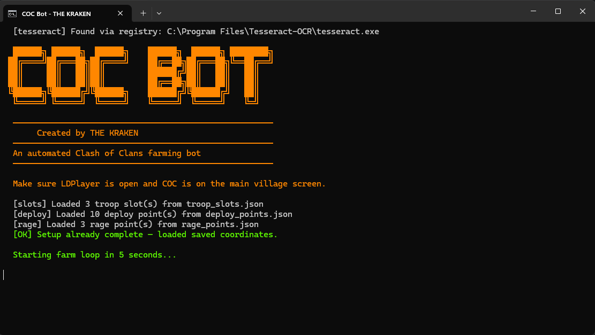

# Youtube Tutorial:

https://www.youtube.com/watch?v=SZFzFoWZHF4

# COC Farming Bot

Automated Clash of Clans Farming Bot



## Requirements
  - Windows 7, 10 or 11 (64-bit)
  - LDPlayer emulator installed and running
  - Clash of Clans installed inside LDPlayer

## Setup

1. Install LDPlayer9
   After installation, configure LDPlayer9
   - Open LDPlayer → Settings → Others
   - Enable ADB debugging → Enable local connection
   - Go to Display and set resolution to 1600 x 900 (DPI 240)

2. Run setup.bat
   - Installs Python, all packages, Tesseract OCR, and ADB
   - Creates run.bat and reconfigure.bat shortcuts

3. Run run.bat
   - First run: answers a few questions (troops, heroes, spells)
   - Then opens a visual planner to pin your troop bar slots
   - Then opens a visual planner to pin where troops deploy
   - Then farms automatically forever

## Generated Files (auto-created, do not edit manually)

- `config.json` - your troop/spell/loot settings
- `troop_slots.json` - pinned troop bar coordinates
- `deploy_points.json` - pinned deploy coordinates
- `rage_points.json` - pinned rage spells coordinates
- `debug_*.png` - debug screenshots (safe to delete)

## Command Line Options

```
python app.py                   # normal start
python app.py --reconfigure     # wipe settings, start fresh
python app.py --setup-only      # re-pin coordinates only
python app.py --farm-only       # skip setup, farm immediately
```

Or use the `.bat` shortcuts instead.

## Changing Settings

Run `reconfigure.bat` to change:
  - Number of troops / heroes / spells
  - Minimum gold threshold
  - Re-pin troop slot positions
  - Re-pin deploy positions

## Troubleshooting

**Bot cannot find attack button**
- Make sure COC is on the MAIN VILLAGE screen
- Check templates/ folder has all .png files

**Screenshot fails / ADB error**
- Open LDPlayer → Settings → ADB debugging ON, port 5555
- Run: `adb connect 127.0.0.1:5555` in a command prompt

**Gold OCR reads wrong values**
- Check debug_gold_roi.png to see what the bot sees
- Adjust MIN_GOLD in config.json if needed

**Air defenses not detected**
- Add cleaner template images to templates/air_defense/
- Lower AIR_DEF_THRESHOLD in app.py (try 0.65)

**Tesseract not found error**
- Reinstall Tesseract to: `C:\Program Files\Tesseract-OCR\`
- Do NOT change the install path
